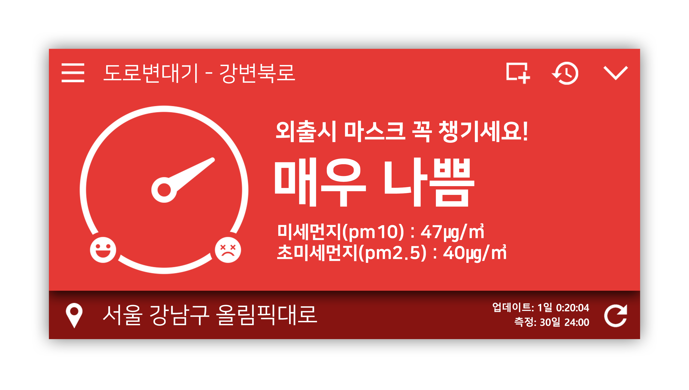

# monZi

https://monzi.ze.am/

Windows PC용 미세먼지 조회·알림 프로그램

## 현재 포함된 것
- monZi 프로젝트 코드
- monZi GUI 리소스 (일부 psd 원본 포함)
- monZi WAV 리소스 (구버전 포함)
- [monZI API 캐싱 파이썬 스크립트](https://github.com/pdjdev/monZi/tree/master/apiscript)

## 직접 빌드하기
### 요구 조건
- Windows 7 이상의 OS (Windows 10 1903+ 권장)
- Visual Studio 2017 이상 버전의 비주얼 스튜디오
- .Net Framework 4.6.1 SDK
- 컴퓨터
### 순서
1. 해당 리포지토리를 받습니다.
2. 비주얼 스튜디오로 프로젝트를 엽니다.
3. 윈폼 GUI가 정상적으로 출력되는지 확인합니다.
4. (중요) API 모듈은 포함되어 있지 않기 때문에, 직접 작성해 주셔야 합니다. (자세한 것은 후술)
5. API 모듈 작성 후, 빌드를 해 봅니다.
6. 정상 작동이 되는것을 확인하면 끄읕

## API 모듈을 작성하는 방법
`AirAPIModule.vb`, `LocalAPIModule.vb` 와 같은 식으로 프로젝트 내에 모듈을 생성하면 됩니다.

대기 상태 조회는 한국환경공단 에어코리아 오픈 API를, 위치 관련 조회는 카카오 로컬 API를 사용하시는것을 추천합니다.

### 코드에 작성된 함수명, 설명
현재 코드는 아래와 같은 함수명을 통하여 코딩되어 있습니다. 아래를 그대로 맞춰 함수를 작성하거나, 아니면 찾기(Ctrl+F3)로 '현재 프로젝트'로 범위를 맞춘 뒤 바꾸셔도 됩니다.


```getairinfo(station As String) As String```
- 측정소명을 통해 해당 측정소의 대기 상태를 String으로 받는 함수입니다. 만약 AirKorea로 값을 받는 경우 최종적으로 이 함수를 통해 측정소 대기 상태를 XML 형식으로 받아오게 됩니다.

```getNearStation(xnum As String, ynum As String) As String```
- 입력한 x좌표, y좌표를 기준으로 가장 가까운 측정소 목록을 받는 함수입니다. 만약 AirKorea로 값을 받는 경우 측정소의 대략적인 정보를 담은 리스트를 XML 형식으로 받아오게 됩니다.

```findStationByName(name As String) As String```
- 입력한 검색어를 기준으로 측정소 정보를 받는 함수입니다. 만약 AirKorea로 값을 받는 경우 검색 결과를 담은 리스트가 XML 형식으로 받아오게 됩니다.

```getLocationKakao(query As String) As String```
- 입력한 검색어에 맞는 위치를 탐색하여 정확한 주소와 좌표를 반환하는 함수입니다. 만약 카카오 API로 값을 받는 경우 검색 결과 목록을 json 형식으로 받아오게 됩니다.

```convertToTMKakao(xnum As String, ynum As String) As String```
- 입력한 좌표를 TM 단위에 맞게 변환하는 함수입니다. 만약 카카오 API로 값을 받는 경우 변환 결과를 json 형식으로 받아오게 됩니다. 만약 `getNearStation` 함수가 AirKorea API를 이용한다면 해당 API는 TM 좌표 기준으로 요청값을 받기 때문에 TM 좌표 변환 과정이 필요합니다.


### 작성 예시
- 개인 라즈베리 파이 서버에서 측정소명을 통해 대기 상태를 불러오는 함수
```
    Function getairinfo_pi(station As String)
        '요청 링크
        Dim request = "http://mypi.myhost.com/monzi/update/stations/"
        request += Web.HttpUtility.UrlEncode(station) + ".xml"

        Dim xmlstr As String = webget(request)
        Return xmlstr
    End Function
```

- 카카오 위치 검색 API로 위치 찾는 함수
```
    Public Function getLocationKakao(query As String)

        Dim url As String = "https://dapi.kakao.com/v2/local/search/address.xml?query=" & query
        Dim request As HttpWebRequest = CType(WebRequest.Create(url), HttpWebRequest)
        With request.Headers
            .Add("Authorization", MapApiKey)
        End With

        Dim response As HttpWebResponse = CType(request.GetResponse(), HttpWebResponse)
        Dim status As String = response.StatusCode.ToString()

        If status = "OK" Then
            Dim stream As Stream = response.GetResponseStream()
            Dim reader As StreamReader = New StreamReader(stream)
            Dim text As String = reader.ReadToEnd()

            Return text
        Else
            Return Nothing
        End If
        
    End Function
```

## 빌드시 참고/주의사항
1. 이 리포지토리는 실제 릴리즈와는 다르게 불안정하고 실험적인 기능이 있을 수 있습니다. 실생활에서 무난하게 이용하고 싶으신 분들은 굳이 빌드하지 않으셔도 되고 [공식 다운로드 페이지](https://monzi.ze.am)에서 정식 릴리즈를 설치하시는것이 좋습니다.

2. 해당 프로젝트는 [GPL 3.0 라이센스](https://raw.githubusercontent.com/pdjdev/monZi/master/LICENSE)를 따르고 있습니다. 그렇기 때문에 법에 재촉되는 목적으로 이용하실 수 없으며, 해당 프로젝트를 이용하였을 시 이용한 프로젝트도 마찬가지로 공개해 주셔야 합니다. 상업적& 이용은 가능합니다.

3. VB.net으로 작성되었습니다만, 이론상 C#으로 마이그레이션도 가능합니다. 현재 WPF GUI 반영을 위해 마이그레이션 작업중입니다. 일부 C# 코드를 사용하고 싶은데 `\Migration` 에 없는 경우 [VB.net C# Converter](http://converter.telerik.com/)를 이용해 주시면 됩니다.

4. 여담으로, 20190915 기준 리눅스에서도 Wine과 .Net Framework 4.6.1을 설치한 상태에서 실사용이 가능할 정도로 작동합니다. (위젯 기능이 좀 불안정하더라구요)

