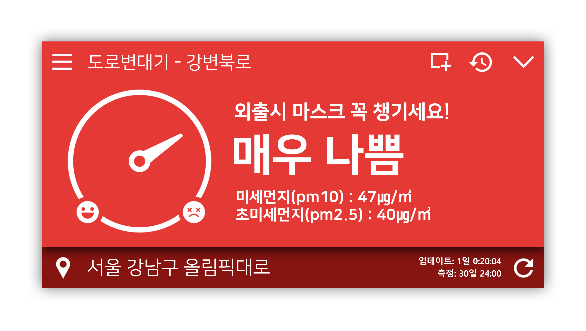

# monZi

https://monzi.pbj.kr/

Windows PC용 미세먼지 조회·알림 프로그램

## 현재 포함된 것
- monZi 프로젝트 코드
- monZi GUI 리소스 (일부 psd 원본 포함)
- monZi WAV 리소스 (구버전 포함)
- [monZI API 캐싱 파이썬 스크립트](https://github.com/pdjdev/monZi/tree/master/apiscript)

## 직접 빌드하기
### 요구 조건
- Windows 7 이상의 OS (Windows 10 1903+ 권장)
- Visual Studio 2017 이상 버전의 비주얼 스튜디오
- .Net Framework 4.8 SDK
- 컴퓨터
### 순서
1. 해당 리포지토리를 받습니다.
2. 비주얼 스튜디오로 프로젝트를 엽니다.
3. 윈폼 GUI가 정상적으로 출력되는지 확인합니다.
4. 빌드 후 정상 작동이 되는것을 확인하면 끄읕
